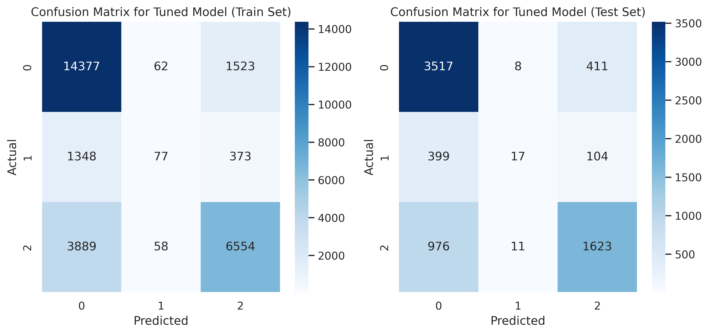
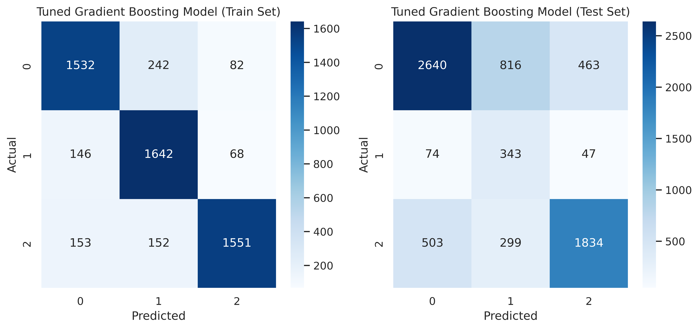
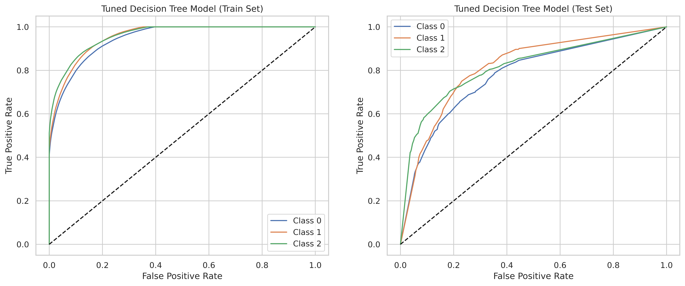

# Supervised ML Classifiers for Predicting Water Wells Condition

## 1. Project Overview

This project explores the use of supervised machine learning classifiers to predict the condition of water wells in Tanzania. By leveraging a ternary classification approach, the goal is to distinguish between wells that are functional, non-functional, or functional but in need of repair. The workflow encompasses data preprocessing, model building, evaluation, and actionable recommendations to support sustainable water resource management.

## 2. Business Understanding

Access to clean and reliable water is a critical challenge in Tanzania. Many wells fall into disrepair or become non-functional, impacting communities' health and livelihoods. Predicting the condition of water wells enables stakeholders to prioritize maintenance, allocate resources efficiently, and ensure long-term water access. This project addresses the question: **Can the operational status of water wells be accurately predicted using available data and machine learning?**

## 3. Data Preprocessing

The dataset consists of features such as location, construction year, installer, well type, and other attributes relevant to water well functionality. The preprocessing phase involved several key steps:

- **Data Cleaning:** Remove irrelevant columns per the project's scope, drop duplicate records, and handle missing values.
- **Feature Engineering:** Enginner the `well-age` feature based on `construction_year` and `date_recorded`.
- **Label Encode Target variable:** Transform the three categories of the target variable to numerical identifiers (Functional = 0), (Functional needs repair = 1), and (Non functional = 2)
- **Encoding Categorical Features:** OneHot Encode categorical features to ensure compatibility with machine learning algorithms.
- **Scaling and Normalization:** Standardize numerical features via the MinMaxScaling technique to ensure uniformity and improve model convergence.
- **Train-Test Split:** Divide the dataset into training and test sets to enable unbiased model evaluation and avoid data leakage.
- **Majority Classes' Undersampling:** Undersample the majority classes for the target variable to ensure the number of samples is equal across the three categories to minimize bias.

These steps ensure that the data is clean, consistent, balanced and suitable for robust modeling.

## 4. Modelling

Multiple supervised classifiers are implemented and compared to address the ternary classification problem:

- **Logistic Regression (Baseline):** Serves as a simple, interpretable benchmark for multiclass classification. Both untuned and hyperparameter-tuned versions were evaluated.
- **Decision Tree Classifier:** Captures non-linear relationships and feature interactions. The model is optimized through grid search, adjusting parameters such as tree depth and minimum samples per split.
- **Gradient Boosting Classifier:** Ensemble learning is leveraged to combine multiple weak learners for improved accuracy. Hyperparameter tuning is performed to optimize the number of estimators, learning rate, and tree depth.

Model selection and tuning are guided by cross-validation and grid search to identify the best-performing configurations for each classifier.

## 5. Model Evaluation

### Confusion Matrices
They capture the counts of a model's True Positives, True Negatives, False Positive, and False Negatives. Confusion Matrices are plotted for each model's performance on the Train set and the Test sets to highlight the respective strengths and weaknesses of each classifier.

**Logistic Regression (Tuned):**

**Decision Tree (Tuned):**

**Gradient Boosting (Tuned):**

### ROC Curves
ROC curves visualize each model's trade-off between sensitivity and specificity for each category of the target variable. The Area Under the Curve (AUC) highlights each classifier's discrimination ability.

**Logistic Regression (Tuned):**

**Decision Tree (Tuned):**

**Gradient Boosting (Tuned):**

**Selected Model for Deployment:** -The Gradient Boosting Classifier consistently outperformed other models, achieving the highest accuracy and balanced performance across all classes, as evidenced by the evaluation metrics and visualizations.

### Top 15 Important Features

## 6. Conclusion

The analysis demonstrates that tuned supervised ML models can effectively predict the condition of water wells using appropriately preprocessed features. The tuned Gradient Boosting Classifier is particularly a powerful, highly generalizable model that stakeholders in the Tanzanian water sector can leverage to to anticipate well failures and plan interventions proactively. This model was validated by predicting the target variable's value for 14,847 entries from a previously unseen dataset (**testdata.csv**).

## 7. Business Recommendations

- **Prioritize Maintenance:** Model predictions can be used to identify wells at risk and allocate maintenance resources efficiently.
- **Data Collection:** Continued improvement of data quality, especially for key features influencing well condition, is recommended.
- **Stakeholder Engagement:** Insights should be shared with local authorities and NGOs to inform decision-making and maximize impact.

## 8. Next Steps

- **Model Deployment:** Integration of the best-performing model into a user-friendly dashboard for real-time predictions.
- **Feature Expansion:** Incorporation of additional data sources (e.g., weather, usage patterns) to enhance model accuracy.
- **Continuous Monitoring:** Regular updates to the model with new data to maintain performance and relevance.
